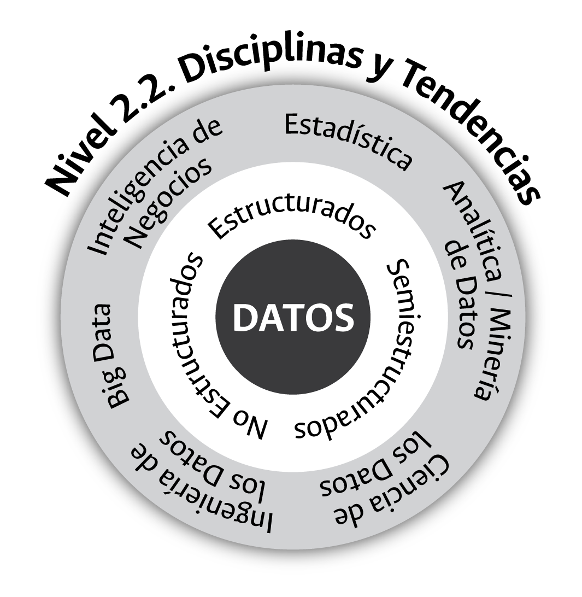

count: none
background-image: url("Imagenes/Portada1.png")
background-position: center
background-size: cover
class: mititulo


```{r setup, include=FALSE}
options(htmltools.dir.version = FALSE,  htmltools.preserve.raw = FALSE)
```

<!-- Uso de funcionalidades de xaringan extras -->

```{r xaringan-tile-view, echo=FALSE}
xaringanExtra::use_tile_view()
```

```{r xaringan-panelset, echo=FALSE}
xaringanExtra::use_panelset()
```

```{r xaringan-scribble, echo=FALSE}
xaringanExtra::use_scribble()
```

```{r xaringan-webcam, include = FALSE}
xaringanExtra::use_webcam()
```

```{r xaringan-logo, echo=FALSE}
xaringanExtra::use_logo(
  image_url = "https://raw.githubusercontent.com/estadisticaun/TendenciasCSU/master/Imagenes/LOGOSIMBOLO%20LATERAL.png", width = "115px",
  height = "133px")
```

```{r echo=FALSE}
xaringanExtra::style_panelset_tabs(
  active_foreground = "#0051BA",
  hover_foreground = "#d22",
  font_family = "Roboto"
)
```


<!-- INICIO DE LA PRESENTACIÓN -->
---
## Consideraciones para el uso adecuado de la presentación

  1.	<p align="justify">Dar click en la letra <b>H</b> o en el símbolo <b>?</b> para desplegar las distintas <b>opciones de navegación</b> que ofrece la presentación.</p>
  
  2.	<p align="justify">Si uno o más objetos gráficos presentan algún grado de desconfiguración/deformación, recargar las presentación dando click en la tecla  <b>F5</b> si nos encontramos en un PC o directamente desde la barra del navegador.</p>

---
## Contenido

<br>

1. <p align="justify">**Una premisa**
<br>
2. <p align="justify">**¿Cuáles son los beneficios de contar y de gestionar las herramientas tecnológicas en el contexto de los datos?**
<br>
3. <p align="justify">**En el contexto de lo público, ¿cuáles herramientas y plataformas tecnológicas se requieren para la gestión moderna de los datos?**
<br>
4. <p align="justify">**En el contexto de lo público, ¿qué aspectos debemos tener en cuenta para adquirir y gestionar las plataformas tecnológicas orientadas a la gestión moderna de los datos?**

---
class: inverse, center, middle

# Una premisa

---
### Un riesgo para la gestión de la información cuantitativa en las entidades públicas
<h4 style="color:Red;">¡La tecnología como fin y no como medio!</h4>
<br>
```{r risk, fig.align='center', out.width='60%', fig.show='hold', echo=FALSE}
knitr::include_graphics('Imagenes/Riesgo2.jpg')
```
 
---
class: inverse, center, middle

# ¿Cuáles son los beneficios de contar y de gestionar las herramientas tecnológicas en el contexto de los datos?

---
# Posibilidades que nos ofrece la gestión moderna de las herramientas tecnológicas

Somos una generación privilegiada dada las posibilidades que nos ofrecen las TIC. En el contexto de los datos y su gestión en el ámbito de lo público, sólo por presentar algunos ejemplos, estas herramientas nos sirven para:


1. Presentar/visualizar información de estadísticas e indicadores

2. Construir boletines estadísticos interactivos

3. Construir y disponer libros

4. Realizar presentaciones

5. realizar investigaciones desde diversas perspectivas

6. Lo más importante, disponer en la web todo el conocimiento contenido en los datos institucionales (transparencia)

---
### 1. Ejemplo Dashboards - Aspirantes a pregrado - UNAL

.panelset[
.panel[.panel-name[Evolución]

<iframe width="100%" height="440px" frameborder="0" mozallowfullscreen="true" webkitallowfullscreen="true" allowfullscreen="true" src="https://estadisticaun.github.io/G_AspAdm/Nal/AspPre/Serie.html"></iframe>

<font size=1><i><b>Fuente:</b> Dirección Nacional de Planeación y Estadística con base en información provista por la Dirección Nacional de Admisiones</i></font> 
]
.panel[.panel-name[Sexo]

<iframe width="100%" height="440px" frameborder="0" mozallowfullscreen="true" webkitallowfullscreen="true" allowfullscreen="true" src="https://estadisticaun.github.io/G_AspAdm/Nal/AspPre/S_sexo.html"></iframe>

<font size=1><i><b>Fuente:</b> Dirección Nacional de Planeación y Estadística con base en información provista por la Dirección Nacional de Admisiones</i></font> 
]

.panel[.panel-name[Estrato]

<iframe width="100%" height="440px" frameborder="0" mozallowfullscreen="true" webkitallowfullscreen="true" allowfullscreen="true" src="https://estadisticaun.github.io/G_AspAdm/Nal/AspPre/S_estrato.html"></iframe>

<font size=1><i><b>Fuente:</b> Dirección Nacional de Planeación y Estadística con base en información provista por la Dirección Nacional de Admisiones</i></font> 
]

.panel[.panel-name[Nacimiento]
<iframe width="100%" height="440px" frameborder="0" mozallowfullscreen="true" webkitallowfullscreen="true" allowfullscreen="true" src="https://estadisticaun.github.io/G_AspAdm/Nal/AspPre/Nac_comb.html"></iframe>

<font size=1><i><b>Fuente:</b> Dirección Nacional de Planeación y Estadística con base en información provista por la Dirección Nacional de Admisiones</i></font> 
]

.panel[.panel-name[Inscripción]
<iframe width="100%" height="440px" frameborder="0" mozallowfullscreen="true" webkitallowfullscreen="true" allowfullscreen="true" src="https://estadisticaun.github.io/G_AspAdm/Nal/AspPre/S_modalidad.html"></iframe>

<font size=1><i><b>Fuente:</b> Dirección Nacional de Planeación y Estadística con base en información provista por la Dirección Nacional de Admisiones</i></font> 
]

.panel[.panel-name[PAES]
<iframe width="100%" height="440px" frameborder="0" mozallowfullscreen="true" webkitallowfullscreen="true" allowfullscreen="true" src="https://estadisticaun.github.io/G_AspAdm/Nal/AspPre/S_paes.html"></iframe>

<font size=1><i><b>Fuente:</b> Dirección Nacional de Planeación y Estadística con base en información provista por la Dirección Nacional de Admisiones</i></font> 
]

.panel[.panel-name[Tabla]
<iframe width="100%" height="400px" frameborder="0" mozallowfullscreen="true" webkitallowfullscreen="true" allowfullscreen="true" src="https://estadisticaun.github.io/G_AspAdm/Nal/AspPre/T_sede.html"></iframe>

<font size=1><i><b>Fuente:</b> Dirección Nacional de Planeación y Estadística con base en información provista por la Dirección Nacional de Admisiones</i></font> 
]
]

---
### 2. Ejemplo - Boletines Interactivos


### Sede Orinoquía - UNAL
<html>
<center>
<iframe width="580" height="320" src="https://www.youtube.com/embed/seEIJvhRPfg?rel=0&amp;controls=0&amp;showinfo=0" frameborder="0" gesture="media" allow="encrypted-media" allowfullscreen></iframe>
</center>
</html>

<br>

<font size=4><i>Ir al boletín estadístico de la Sede<br>
Disponible en:<a href="https://estadisticaun.github.io/BoletinOrinoquia1/">https://estadisticaun.github.io/BoletinOrinoquia1/</a></i></font> 

---
### 3. Ejemplo - Libros

```{r libroc, fig.align='center', out.width='45%', fig.show='hold', echo=FALSE}
knitr::include_graphics('Imagenes/Portada.jpg')
```

<font size=2><b>Disponible en: </b><a href="https://estadisticaun.github.io/L_Conceptual">https://estadisticaun.github.io/L_Conceptual</a></font>


---
### 4. Ejemplo - Presentaciones


```{r Orquesta, fig.align='center', out.width='38%', fig.show='hold', echo=FALSE}
knitr::include_graphics('Imagenes/Orquesta.jpg')
```

<p align="justify"><h4 style="color:Blue;">No hay mejor experiencia que la práctica/realidad. Esta presentación es una muestra de las posibilidades que nos ofrecen las TIC.</h4>
<br>


---
### 5. Ejemplo - Aproximaciones académicas

```{r fig100, fig.align='center', out.width='60%', fig.show='hold', echo=FALSE}

```
<font size=2><b>Disponible en: </b><a href="https://raw.githubusercontent.com/estadisticaun/L_Conceptual/master/imagenes/F_10.png?token=AHYPBYTXQHTF43XSP72ZT53AXYMKC">Capítulo 3. Gestión de la Información en las Universidades.</a></font>

---
### 6. Ejemplo - Disponer la información cuantitativa en la web

En la actualidad, la web es quizás el mejor instrumento tecnológico para la **transparencia institucional** y la **rendición permanente de cuentas**.<br> 
<h5 style="color:Red;">¡Lo que no está en internet, "parece que no existe"!

```{r web, fig.align='center', out.width='80%', fig.show='hold', echo=FALSE}
knitr::include_graphics('Imagenes/Laweb.png')
```

---
class: inverse, center, middle

# En el contexto de lo público, ¿cuáles herramientas y plataformas tecnológicas se requieren para la gestión moderna de los datos?

---
#### Herramientas tecnológicas y cadena de valor del dato

.panelset[

.panel[.panel-name[Cadena de valor]
<br>
<br>
<br>
<br>
```{r valor, fig.align='center', out.width='100%', fig.show='hold', echo=FALSE}

```
]

.panel[.panel-name[Datos]
.pull-left[
<p align="justify"> Los datos son una representación simbólica cuantitativa o cualitativa de una característica particular de la realidad que se obtiene a través de un procedimiento de captura o transferencia.

```{r datos, fig.align='center', out.width='55%', fig.show='hold', echo=FALSE}
knitr::include_graphics('Imagenes/F_9.png')
```
<font size=1><b>Disponible en: </b><a href="https://raw.githubusercontent.com/estadisticaun/L_Conceptual/master/imagenes/F_9.png?token=AHYPBYXQ2ZQXAQDE7VOR7ILAXYMBM">Capítulo 3. Gestión de la Información en las Universidades.</a></font>
]
.pull-right[
```{r sql, fig.align='center', out.width='80%', fig.show='hold', echo=FALSE}

```
<font size=1><b>Disponible en: </b><a href="https://raw.githubusercontent.com/estadisticaun/DAFP_tecnologia/main/Imagenes/SQLNOSQL.png">https://towardsdatascience.com/datastore-choices-sql-vs-nosql-database-ebec24d56106.</a></font>
]
]

.panel[.panel-name[Transformación y almacenamiento]
.pull-left[
<br>
<br>
<br>
```{r almac, fig.align='center', out.width='80%', fig.show='hold', echo=FALSE}

```
]
.pull-right[
```{r almacen, fig.align='center', out.width='80%', fig.show='hold', echo=FALSE}

```
]
]

.panel[.panel-name[Información]
.pull-left[
<br>
<br>
<br>
```{r info, fig.align='center', out.width='80%', fig.show='hold', echo=FALSE}

```
]
.pull-right[
```{r informa, fig.align='center', out.width='75%', fig.show='hold', echo=FALSE}

```
]
]

.panel[.panel-name[Comunicación]
.pull-left[
<br>
<br>
<br>
```{r comu, fig.align='center', out.width='80%', fig.show='hold', echo=FALSE}

```
]
.pull-right[
```{r comunica, fig.align='center', out.width='75%', fig.show='hold', echo=FALSE}

```
]
]

.panel[.panel-name[Las decisiones]
<br>
<br>
La gestión de los datos y su transformación en información tiene sentido si la misma sirve, como mínimo, para:
<br>
1. La planeación
2. La rendición de cuentas
3. La evaluación
4. La aproximación a las causas
5. La transparencia institucional

]

.panel[.panel-name[En conclusión]
```{r Herramientas, fig.align='center', out.width='50%', fig.show='hold', echo=FALSE}
knitr::include_graphics('Imagenes/F_14.png')
```
<font size=2><b>Disponible en: </b><a href="https://raw.githubusercontent.com/estadisticaun/DAFP_tecnologia/main/Imagenes/F_14.png">Capítulo 3. Gestión de la Información en las Universidades.</a></font>
]

.panel[.panel-name[Herramientas en la UNAL]
<br>
<br>
```{r unal, fig.align='center', out.width='100%', fig.show='hold', echo=FALSE}
knitr::include_graphics('Imagenes/UNAL.png')
```
]
]


---
class: inverse, center, middle

# En el contexto de lo público, ¿qué aspectos debemos tener en cuenta para adquirir y gestionar las plataformas tecnológicas orientadas a la gestión moderna de los datos?

---
## Aspectos a tener en cuenta

.panelset[

.panel[.panel-name[Lo primero]

<br>

* <p align="justify">En lo público, en el ejercicio de selección de herramientas, debe primar la **neutralidad tecnológica**. 

* <p align="justify">El problema central para la selección de herramientas, además de su costo, es su variedad y su cantidad. 
<h4 style="color:Red;"><p align="justify">¡Hoy no escasean las plataformas y herramientas para la gestión de datos; hoy, en sentido estricto, sobran!

]

.panel[.panel-name[Tipos]
```{r Herra1, fig.align='center', out.width='70%', fig.show='hold', echo=FALSE}

```
]

.panel[.panel-name[Herramientas]
```{r Herra2, fig.align='center', out.width='75%', fig.show='hold', echo=FALSE}
knitr::include_graphics('Imagenes/Herra_2.png')
```
<font size=2><b>Enlace: </b><a href="https://keshif.me/demo/VisTools#515">Un inventario de herramientas tecnológicas para la visualización de los datos.</a></font>
]

.panel[.panel-name[Ventajas y desventajas]
```{r Herramientasf, fig.align='center', out.width='90%', fig.show='hold', echo=FALSE}

```
]

.panel[.panel-name[El talento humano]

<p align="justify">La gestión contemporánea de los datos a nivel de las entidades pública exige un perfil profesional o, un grupo de profesionales, experto(s) en las siguientes competencias.
<br>
.pull-left[
```{r Competencias, fig.align='center', out.width='70%', fig.show='hold', echo=FALSE}

```
]
.pull-right[
- <FONT COLOR="red">Matemáticas y estadística</FONT>


- <FONT COLOR="red">Ciencias computacionales (programación)</FONT>


- <FONT COLOR="red">Conocimiento del negocio -entidades-</FONT>


- <FONT COLOR="red">Habilidades blandas</FONT> 
]

]

.panel[.panel-name[Lo más importante]
<br>
<br>
<p align="justify">La tecnología disponible y su uso para la gestión de los datos adquiere sentido, en el ámbito de lo público, si esta sirve para construir una mejor sociedad a través de la disposición de bienes y servicios que reduzcan los nivéles de desigualdad históricos que han caracterizado a nuestro país.
]
]

---
class: inverse, center, middle

# ¡Muchas gracias!
<br>
## El contenido de esta presentación se encuentra disponible en:<br>
[https://estadisticaun.github.io/UIS_gestion/#1](https://estadisticaun.github.io/UIS_gestion/#1)
<br>
## Información de contacto:
Nombre: Alberto Rodríguez R <br>
Mail: albrodriguezr@unal.edu.co <br> estadistica_nal@unal.edu.co<br>
Teléfono: 3165000 Ext. 18519 - 18159<br>
